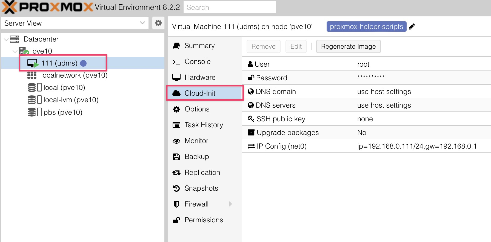
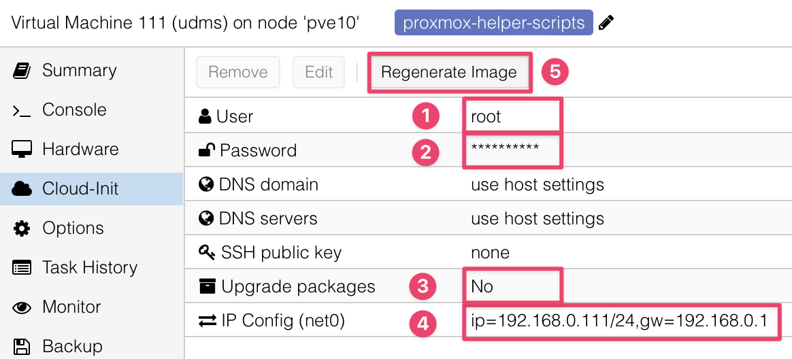
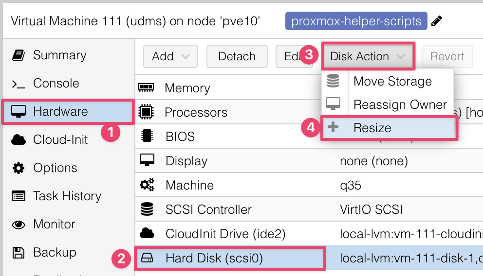

# Cloud-Init Ubuntu VM Installation
{: .no_toc }

VM setup
{: .label .label-purple }

## Table of contents
{: .no_toc .text-delta }

1. TOC
{:toc}

---

## Background: Cloud-Init Server install using tteck's Proxmox VE Helper script

I have found tteck's Cloud-Init server installation method to be much faster than doing a manual Ubuntu installation. The only "gotcha" is in the warning below!

{: .warning }
> For iGPU passthrough, the required files in `linux-generic` **are NOT part of the Ubuntu Cloud-Init distribution** used by the tteck Ubuntu installation script. 
>
>That means we have to **remember to load them** using `sudo apt install sudo linux-generic` after starting the VM for the first time. So follow these instructions to the end of this page!

## Run tteck's Ubuntu 24.04 installation script

We are going to run tteck's Ubuntu 24.04 script found at [https://community-scripts.github.io/ProxmoxVE/scripts?id=ubuntu2404-vm](https://community-scripts.github.io/ProxmoxVE/scripts?id=ubuntu2404-vm){:target="_blank"}

{: .important }
> Run tteck scripts from the **Proxmox GUI shell**, not SSH!

```sh
bash -c "$(wget -qLO - https://github.com/community-scripts/ProxmoxVE/raw/main/vm/ubuntu2404-vm.sh)"
```

{: .warning }
> DO NOT START the VM until after you do the following Cloud-Init setup steps below! ⬇

## Fill in Cloud-Init Data

In the steps below, we are going to follow most of tteck's detailed [Cloud-Init setup](https://github.com/community-scripts/ProxmoxVE/discussions/272){:target="_blank"} instructions at [https://github.com/community-scripts/ProxmoxVE/discussions/272](https://github.com/community-scripts/ProxmoxVE/discussions/272){:target="_blank"}.

{: .important }
> If you prefer to use tteck's steps above, **STOP** at the **"Install Docker"** step.
> 
> We will install Docker later using Anand's excellent [SimpleHomelab Deployarr](https://github.com/SimpleHomelab/deployarr){:target="_blank"} application.

### Click on `Cloud-Init` in the VM's vertical middle menu bar




### Fill in the `Cloud-Init` settings

1. Set user to `root`
2. Give root user a password
3. Set to `No` (not enough storage, yet)
4. Set network settings (IP/CIDR and gateway)
5. Click `Regenerate Image`

    {:width="75%"}

6. It is now OK to click `▶ Start` to start the VM!

## Resize the bootdisk `(/dev/sda)`

This resizes the boot disk but does not allocate it to the VM. We will use `parted` to do that later.

1. Select `xterm.js` under the `Console` pull down for copy/paste functions
2. Open the 'Resize' screen and enter the size increase you want
 
    `Hardware` &rarr; `Hard Disk (scsi0)` &rarr; `Disk Action` &rarr; `Resize`


{:width="75%"}

## Expand the VM disk partition to use the new space

Type these steps in the `xterm.js` console:

1. Run parted:

    ```sh
    parted /dev/sda
    ```

2. Answer the parted prompts as they appear:
   
    {: .fs-3 }
    > (parted) `resizepart 1`
    >
    > Fix/Ignore? `Fix`
    >
    > Partition number? `1`
    >
    > Yes/No? `Yes`
    >
    > End? [2146MB]? `-0`
    >
    > (parted) `quit`

3. Then reboot:

```sh
reboot
```

## Enable SSH

```sh
sed -i -e 's/#PermitRootLogin prohibit-password/PermitRootLogin yes/g' -e 's/^PasswordAuthentication.*/PasswordAuthentication yes/' /etc/ssh/sshd_config
```

```sh
rm /etc/ssh/sshd_config.d/60-cloudimg-settings.conf
```

```sh
systemctl restart ssh
```

## Add QEMU Guest Agent

```sh
apt-get update && apt-get -y upgrade
```

```sh
apt-get install -y qemu-guest-agent
```

## Install files required for iGPU hardware passthrough

{: .warning }
> Be sure to do this step or iGPU HW passthrough from Proxmox to your new VM will not work!

```sh
sudo apt install sudo linux-generic
```

```sh
reboot
```

## Next Step: GPU Hardware Passthrough

If you have GPU Passthrough implemented on your Proxmox VE bare metal server and want to use it in this VM, follow the [Proxmox GPU Passthrough: VM Setup]() instructions in this doc.
