# Network UPS Tools (NUT) UPS Monitor
{: .no_toc }

NUT UPS setup
{: .label .label-purple }

Synology NAS setup
{: .label .label-blue }

Proxmox host setup
{: .label .label-yellow }

Steps to install NUT UPS monitoring server on a Raspberry Pi, and steps to install the NUT client on Synology NAS and Proxmox hosts.
{: .fs-6 .fw-300 }

My main source is Techno Tim's excellent [Network UPS Tools (NUT) Ultimate Guide](https://technotim.live/posts/NUT-server-guide/){:target="_blank"} and video:

<iframe width="560" height="315" src="https://www.youtube.com/embed/vyBP7wpN72c?si=kGu1ezIWcgKaBJgH" title="YouTube video player" frameborder="0" allow="accelerometer; autoplay; clipboard-write; encrypted-media; gyroscope; picture-in-picture; web-share" referrerpolicy="strict-origin-when-cross-origin" allowfullscreen></iframe>

# 📘 Network UPS Tools (NUT) – Server/Client Interaction Diagram

This document provides a technical flow diagram and detailed explanation of how a Network UPS Tools (NUT) **server** communicates with one or more **clients**. It shows how configuration files and services work together to monitor power status and coordinate safe shutdowns during power events.

---

## 📊 Mermaid Diagram

```mermaid
flowchart LR
  subgraph NUT_Server [NUT Server]
    UPS["🔌 UPS Device"]
    upsconf["📄 ups.conf"]
    upsdrvctl["⚙️ upsdrvctl"]
    upsdconf["📄 upsd.conf"]
    upsdusers["📄 upsd.users"]
    upsd["🔁 upsd (network daemon)"]
    nutconf_srv["📄 nut.conf (netserver)"]
    upsmonconf_srv["📄 upsmon.conf"]
    upsmon_srv["👀 upsmon (monitor)"]
    upsschedconf["📄 upssched.conf (optional)"]
    upsschedcmd["📝 upssched-cmd (optional script)"]
    
    upsconf --> upsdrvctl --> UPS
    upsdconf --> upsd
    upsdusers --> upsd
    upsmonconf_srv --> upsmon_srv
    nutconf_srv --> upsmon_srv
    upsmon_srv --> upsschedconf
    upsschedconf --> upsschedcmd
  end

  subgraph Network
    upsd -. "status & events" .-> upsmon_cli
  end

  subgraph NUT_Client [NUT Client]
    nutconf_cli["📄 nut.conf (netclient)"]
    upsmonconf_cli["📄 upsmon.conf"]
    upsmon_cli["👀 upsmon (monitor)"]
    upsschedconf_cli["📄 upssched.conf (optional)"]
    upsschedcmd_cli["📝 upssched-cmd (optional)"]

    nutconf_cli --> upsmon_cli
    upsmonconf_cli --> upsmon_cli
    upsmon_cli --> upsschedconf_cli
    upsschedconf_cli --> upsschedcmd_cli
  end
```

---

## 🧠 What the Diagram Shows

### 🔌 On the NUT Server:
- **`ups.conf`**: Defines the UPS hardware and the appropriate driver.
- **`upsdrvctl`**: Loads the driver and starts communication with the UPS device.
- **`upsd.conf` + `upsd.users`**: Configure the `upsd` daemon, which shares UPS status with clients over the network.
- **`nut.conf`**: Declares the server's role (`MODE=netserver`).
- **`upsmon.conf`**: Configures how the server monitors UPS state and triggers shutdown if needed.
- **`upsmon`**: Runs the actual monitoring logic.
- **`upssched.conf` + `upssched-cmd`**: (Optional) Define timed/custom actions, like delayed shutdowns or alert scripts.

### 🌐 Network Connection:
- The server's `upsd` listens on port 3493 and sends status updates to `upsmon` processes running on clients.

### 💻 On the NUT Client:
- **`nut.conf`**: Declares the client role (`MODE=netclient`).
- **`upsmon.conf`**: Configures connection to the server and sets the client as a `slave`.
- **`upsmon`**: Listens to UPS events sent by the server’s `upsd` and initiates shutdowns or logging.
- **`upssched.conf` + `upssched-cmd`**: (Optional) Used for custom responses or timers on the client.

---

## ✅ Summary

This diagram illustrates how NUT components interact to deliver reliable UPS monitoring and coordinated system shutdowns. The `upsd` service is the central piece that shares UPS data, while `upsmon` ensures appropriate response on both server and client systems. Optional scheduling scripts can add even more flexibility.

Use this structure to build and debug your own NUT deployments efficiently!

