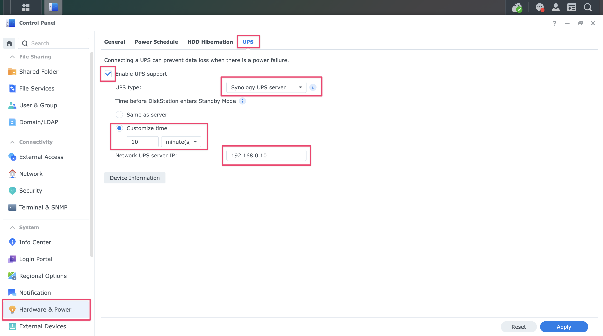
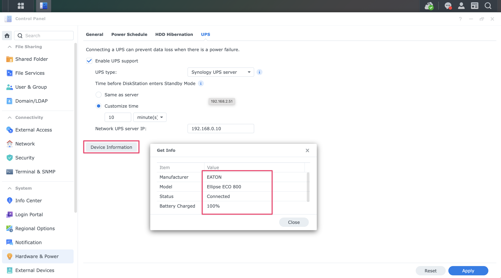

# <i class="fas fa-server fa-rotate-90"></i> NUT Client - Synology NAS
{: .no_toc }

<i class="fas fa-power-off"></i> NUT UPS setup
{: .label .label-rasp } 

<i class="fas fa-server fa-rotate-90" style="color: black"></i> Synology NAS setup
{: .label .label-syno }

## Table of contents
{: .no_toc .text-delta }

1. TOC
{:toc}

---
## Source

Zanshin Dojo's [Synology + Proxmox + NUT UPS](https://blog.zanshindojo.org/nut/){:target="_blank"} is very helpful and is one of the few clear articles I found about how to set up a Synology NAS as a client only, and not as a NUT server.

---

<i class="fas fa-power-off"></i> NUT UPS setup
{: .label .label-rasp } 

## Synology NAS configuration pre-work on NUT server

Synology's DSM OS has a built-in NUT client monitor that doesn't require any SSH file editing. However, the NUT **server** has to be set up properly because Synology's client is hardcoded to use specific NUT UPS and user names.

### Ensure your NUT Server has the proper UPS and user names

{: .warning }
>You have to name things as below or the Synology will refuse to connect. They can't be called anything else.

1. UPS name in the `ups.conf` file on the NUT server must be called `ups`.
2. User name in the `upsd.users` file on the NUT server must be called `admin` with password `secret`.

{: .note }
>
> The instructions in this document already name things so that the NUT server will work with the Synology NUT client.

---

<i class="fas fa-server fa-rotate-90" style="color: black"></i> Synology NAS setup
{: .label .label-syno }

## Set up UPS client in the Synology DSM UI

### Enter your NUT server's IP address into the Synology DSM UPS screen in <mark>Control Panel</mark>
 

Click:  

<mark>&nbsp; <i class="fas fa-lightbulb"></i> Hardware & Power &nbsp;</mark> &rarr; <mark>&nbsp; UPS &nbsp;</mark> 

Fill the screen out like below:

### Check the NAS connection to your UPS by clicking <mark>Device Information</mark> and reviewing the table in the popup:

