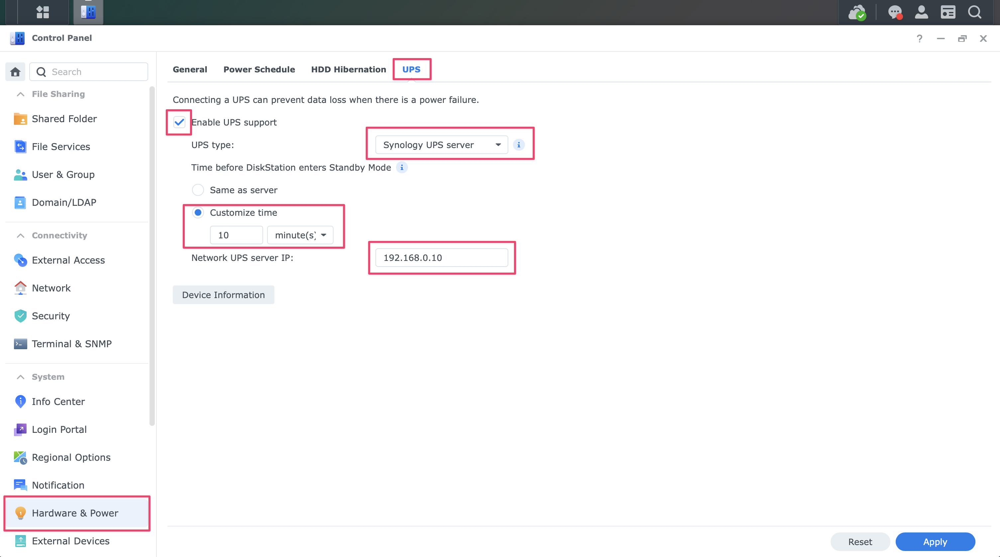
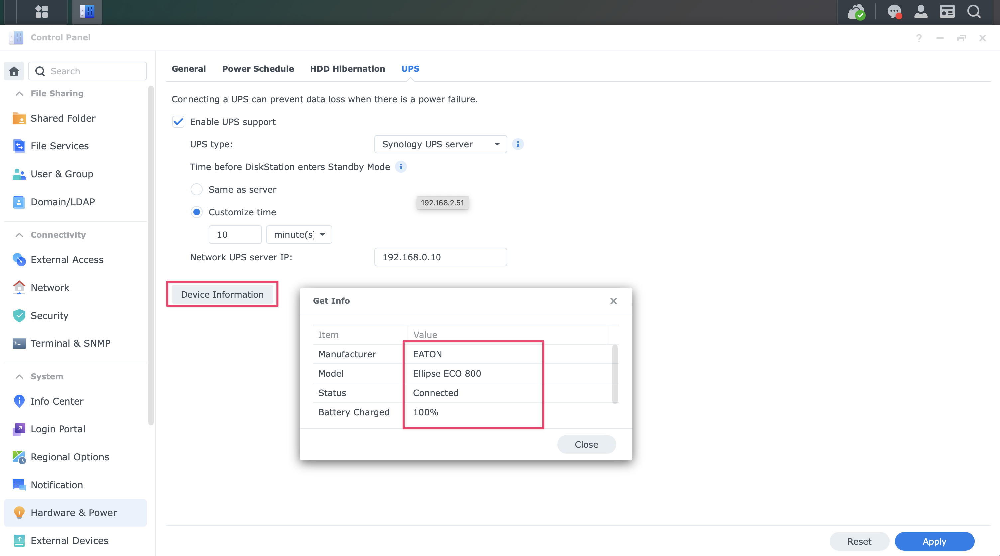

# <i class="fas fa-server fa-rotate-90"></i> NUT Client - Synology NAS
{: .no_toc }

<i class="fas fa-power-off"></i> NUT UPS setup
{: .label .label-rasp } 

<i class="fas fa-server fa-rotate-90" style="color: black"></i> Synology NAS setup
{: .label .label-syno }

## Table of contents
{: .no_toc .text-delta }

1. TOC
{:toc}

---
## Source

Zanshin Dojo's [Synology + Proxmox + NUT UPS](https://blog.zanshindojo.org/nut/){:target="_blank"} is very helpful and is one of the few clear articles I found about how to set up a Synology NAS as a client only, and not as a NUT server.

---

<i class="fas fa-power-off"></i> NUT UPS setup
{: .label .label-rasp } 

## Synology NAS configuration pre-work on NUT server

Synology's DSM OS has a built-in NUT client monitor that doesn't require any SSH file editing. However, the NUT **server** has to be set up properly because Synology's client is hardcoded to use specific NUT UPS and user names.

{: .warning }
>You have to name things as below or the Synology will refuse to connect. They can't be called anything else.

### Ensure your NUT Server has the proper UPS and user names


1. A **UPS** name in the `ups.conf` file on the NUT server must be called `ups`.
2. A **user** name in the `upsd.users` file on the NUT server must be called `monuser` with password `secret`. DSM connects as a **secondary**, so this user needs `upsmon slave` privilege:

    ```config
    [monuser]
      password = secret
      upsmon slave
    ```

{: .warning }
> **Corrected 2026-08-25.** Earlier versions of this page said the user had to be called `admin`. That is wrong. `admin` is the account the **NUT server's own** `upsmon` uses on the Raspberry Pi. The Synology authenticates as `monuser`. The two accounts got conflated.
>
> Confirmed from the server log after fixing `upsd.users`:
>
> ```
> User monuser@192.168.0.5 logged into UPS [ups]
> ```

{: .note }
>
> The instructions in this document already name things so that the NUT server will work with the Synology NUT client.

---

<i class="fas fa-server fa-rotate-90" style="color: black"></i> Synology NAS setup
{: .label .label-syno }

## Set up UPS client in the Synology DSM UI

### Enter your NUT server's IP address into the Synology DSM UPS screen in <mark>Control Panel</mark>
 

Click:  

<mark>&nbsp; <i class="fas fa-lightbulb"></i> Hardware & Power &nbsp;</mark> &rarr; <mark>&nbsp; UPS &nbsp;</mark> 

Fill the screen out like below:



### Check the NAS connection to your UPS by clicking <mark>Device Information</mark> and reviewing the table in the popup:



---

## <i class="fas fa-stethoscope"></i> Troubleshooting

### Device Information is necessary but not sufficient

If the <mark>Device Information</mark> popup shows your UPS manufacturer, model, `Connected`, and a battery percentage, the NAS is definitely reading live data from the NUT server. That confirms the **read** path only.

`upsd` serves status reads to anyone who connects. The LOGIN that registers the NAS as a secondary is a separate step, and it can fail while the display still looks perfectly healthy. Check it from the server, below.

### Confirm the connection from the NAS

DSM does not ship `ss`, so use `netstat`. Over SSH to the NAS:

```sh
sudo netstat -tnp | grep 3493
```

A healthy result names `upsmon` as the owning process:

```
tcp  0  0  192.168.0.5:38886  192.168.0.10:3493  ESTABLISHED  21051/upsmon
```

Note that `ps | grep upsmon` on DSM will show nothing even when it is running, because DSM's default `ps` does not list other users' processes. Use `ps -ef | grep -i ups` instead.

### Confirm the login from the NUT server

This is the check that actually matters. On the NUT server:

```sh
sudo journalctl -u nut-server | grep "logged into"
```

You want a line naming the NAS:

```
User monuser@192.168.0.5 logged into UPS [ups]
```

An established TCP connection with **no** matching login line means DSM reached the server and was refused authentication. `upsd` does not log failed logins, so the absence of a success line is the only signal you get.

### Do not trust `/usr/syno/etc/ups/upsmon.conf`

That file is a stock template DSM ships and never edits. On my NAS it still reads `MONITOR ups@localhost 1 monuser secret master`, which contradicts the real configuration in both server address and mode. Reading it will send you in the wrong direction.

The file DSM actually writes when you fill in the UPS screen is `/usr/syno/etc/ups/synoups.conf`:

```config
upsslave_enabled="yes"
ups_mode="slave"
upsslave_server="192.168.0.10"
ups_wait_time="600"
```

`ups_wait_time` is in seconds and corresponds to **Time before DiskStation enters Standby Mode** in the UI.

{: .note }
> That standby timer is DSM's own protection mechanism and runs independently of NUT's primary/secondary forced-shutdown handshake. The NAS will park itself after the configured delay on battery even if the NUT LOGIN is failing. Useful to know, but it also means a broken LOGIN can hide behind working protection indefinitely.
