# <i class="far fa-file-code"></i> NUT Configuration File Reference
{: .no_toc }

<i class="fas fa-power-off"></i> NUT UPS setup
{: .label .label-rasp }

<i class="fas fa-server fa-rotate-90" style="color: black"></i> Synology NAS setup
{: .label .label-syno }

<i class="fab fa-mixer" style="color: black"></i> Proxmox host setup
{: .label .label-proxhost }

## Table of contents
{: .no_toc .text-delta }

1. TOC
{:toc}

---

Network UPS Tools (NUT) uses a modular client-server architecture where one system (the **server**) connects to the UPS hardware and exposes UPS status over the network. Other systems (**clients**) can monitor the UPS and safely shut down based on UPS status.

This guide outlines the configuration files used in NUT, where they are needed (server/client), and when they are required.

---

## <span style="color: #C51A4A"><i class="fas fa-power-off"></i></span> Core Server Configuration Files

### `ups.conf`
- **Purpose**: Defines one or more UPS devices and their drivers.
- **Used by**: `upsdrvctl`
- **Location**: `/etc/nut/ups.conf`
- **Example**:
```config
[myups]
driver = usbhid-ups
port = auto
desc = "APC Back-UPS"
```

---

### `upsd.conf`
- **Purpose**: Configures how the NUT daemon (`upsd`) listens for connections.
- **Used by**: `upsd`
- **Location**: `/etc/nut/upsd.conf`
- **Example**:
```config
LISTEN 127.0.0.1 3493
LISTEN 192.168.1.1 3493
```

---

### `upsd.users`
- **Purpose**: Defines users and their permissions (e.g., for monitoring or shutdown).
- **Used by**: `upsd`
- **Location**: `/etc/nut/upsd.users`
- **Example**:
```config
[monuser]
password = secret
upsmon master
```

---

## <i class="fas fa-server fa-rotate-90" style="color: black"></i> <span style="color: #D6762C"> <i class="fab fa-mixer"></i></span> <i class="fas fa-stethoscope"></i> Client & Monitoring Configuration Files

### `upsmon.conf`
- **Purpose**: Monitors UPS status and triggers system shutdown.
- **Used by**: `upsmon`
- **Location**: `/etc/nut/upsmon.conf`
- **Example** (client):
  ```config
  MONITOR myups@192.168.1.1 1 monuser secret slave
  ```

---

### `nut.conf`
- **Purpose**: Defines the system role: `standalone`, `netserver`, or `netclient`.
- **Used by**: All NUT services
- **Location**: `/etc/nut/nut.conf`
- **Example**:
  ```sh
  MODE=netserver   # on server
  MODE=netclient   # on client
  ```

---

## <i class="fas fa-globe"></i> Web Interface Configuration Files

### `hosts.conf`
- **Purpose**: Lists UPS devices for use in the web interface (e.g., `upsstats.cgi`, `upsset.cgi`).
- **Used by**: Web CGI tools
- **Location**: `/etc/nut/hosts.conf`
- **Example**:
  ```config
  MONITOR myups@localhost "Main UPS"
  MONITOR otherups@192.168.1.100 "Remote UPS"
  ```

---

### `upsset.conf`
- **Purpose**: Defines access permissions for the `upsset.cgi` tool.
- **Used by**: `upsset.cgi`
- **Location**: `/etc/nut/upsset.conf`
- **Example**:
  ```sh
  [myups]
  hostname = localhost
  ```

---

## <i class="far fa-clock"></i> Event Scheduling and Custom Actions

### `upssched.conf`
- **Purpose**: Provides hooks for custom actions or scripts during UPS events (like power failure or low battery).
- **Used by**: `upsmon` via `upssched`
- **Location**: `/etc/nut/upssched.conf`
- **Example**:
  ```bash
  CMDSCRIPT /usr/local/bin/upssched-cmd
  PIPEFN /var/run/nut/upssched.pipe
  LOCKFN /var/run/nut/upssched.lock

  AT ONBATT * START-TIMER onbatt 60
  AT TIMEOUT onbatt EXECUTE powerfail
  ```

---

### `upssched-cmd` (User Script)
- **Purpose**: A user-defined script that gets triggered by `upssched` to handle UPS events.
- **Used by**: `upssched`
- **Location**: User-defined (e.g., `/usr/local/bin/upssched-cmd`)
- **Example**:
  ```bash
  #!/bin/bash
  case $1 in
    powerfail)
      logger "UPS power failure: shutting down"
      /sbin/shutdown -h now
      ;;
    *)
      logger "Unhandled event: $1"
      ;;
  esac
  ```

---

## <i class="fas fa-table"></i> Summary Table

| File              | Purpose                                                  | File Directory      | On Server? | On Client? | Required? |
|-------------------|-----------------------------------------------------------|---------------------|------------|------------|-----------|
| `ups.conf`        | Defines UPS hardware and driver                           | `/etc/nut/ups.conf` | ✅          | ❌          | ✅ (server only) |
| `upsd.conf`       | Configures `upsd` network listener                         | `/etc/nut/upsd.conf`| ✅          | ❌          | ✅ (server only) |
| `upsd.users`      | Defines user accounts and permissions for `upsd`          | `/etc/nut/upsd.users`| ✅         | ❌          | ✅ (server only) |
| `upsmon.conf`     | Configures UPS monitoring and shutdown logic              | `/etc/nut/upsmon.conf`| ✅        | ✅          | ✅          |
| `nut.conf`        | Declares system role (`standalone`, `netserver`, `netclient`) | `/etc/nut/nut.conf`| ✅          | ✅          | ✅          |
| `hosts.conf`      | Lists UPS devices for web UI tools (`upsstats.cgi`, etc.) | `/etc/nut/hosts.conf`| ✅         | ❌ (unless running web UI) | ❌ (optional) |
| `upsset.conf`     | Defines host access for the `upsset.cgi` config tool      | `/etc/nut/upsset.conf`| ✅        | ❌          | ❌ (optional) |
| `upssched.conf`   | Configures timed/custom actions during UPS events         | `/etc/nut/upssched.conf`| ✅      | ✅          | ❌ (optional) |
| `upssched-cmd`    | User-defined script triggered by `upssched`               | (user-defined, e.g. `/usr/local/bin/upssched-cmd`) | ✅ | ✅ | ❌ (if using `upssched`) |

---

## <i class="fas fa-project-diagram"></i> NUT Server/Client Interaction Diagram

I created this detailed diagram of how a Network UPS Tools (NUT) **server** communicates with one or more **clients** because I would become confused troubleshooting my NUT setup. It shows how configuration files and services work together to monitor power status and coordinate safe shutdowns during power events.

```mermaid
flowchart LR
  subgraph NUT_Server [NUT Server]
    UPS["🔌 UPS Device"]
    upsconf["📄 ups.conf"]
    upsdrvctl["⚙️ upsdrvctl"]
    upsdconf["📄 upsd.conf"]
    upsdusers["📄 upsd.users"]
    upsd["🔁 upsd (network daemon)"]
    nutconf_srv["📄 nut.conf (netserver)"]
    upsmonconf_srv["📄 upsmon.conf"]
    upsmon_srv["👀 upsmon (monitor)"]
    upsschedconf["📄 upssched.conf (optional)"]
    upsschedcmd["📝 upssched-cmd (optional script)"]
    
    upsconf --> upsdrvctl --> UPS
    upsdconf --> upsd
    upsdusers --> upsd
    upsmonconf_srv --> upsmon_srv
    nutconf_srv --> upsmon_srv
    upsmon_srv --> upsschedconf
    upsschedconf --> upsschedcmd
  end

  subgraph Network
    upsd -. "status & events" .-> upsmon_cli
  end

  subgraph NUT_Client [NUT Client]
    nutconf_cli["📄 nut.conf (netclient)"]
    upsmonconf_cli["📄 upsmon.conf"]
    upsmon_cli["👀 upsmon (monitor)"]
    upsschedconf_cli["📄 upssched.conf (optional)"]
    upsschedcmd_cli["📝 upssched-cmd (optional)"]

    nutconf_cli --> upsmon_cli
    upsmonconf_cli --> upsmon_cli
    upsmon_cli --> upsschedconf_cli
    upsschedconf_cli --> upsschedcmd_cli
  end
```


## What the Diagram Shows

### <span style="color: #C51A4A"><i class="fas fa-power-off"></i></span> On the NUT Server:
- **`ups.conf`**: Defines the UPS hardware and the appropriate driver.
- **`upsdrvctl`**: Loads the driver and starts communication with the UPS device.
- **`upsd.conf` + `upsd.users`**: Configure the `upsd` daemon, which shares UPS status with clients over the network.
- **`nut.conf`**: Declares the server's role (`MODE=netserver`).
- **`upsmon.conf`**: Configures how the server monitors UPS state and triggers shutdown if needed.
- **`upsmon`**: Runs the actual monitoring logic.
- **`upssched.conf` + `upssched-cmd`**: (Optional) Define timed/custom actions, like delayed shutdowns or alert scripts.

### <i class="fas fa-globe"></i> Network Connection:
- The server's `upsd` listens on port 3493 and sends status updates to `upsmon` processes running on clients.

### <i class="fas fa-server fa-rotate-90" style="color: black"></i> <i class="fab fa-mixer" style="color: #D6762C"></i> On the NUT Client:
- **`nut.conf`**: Declares the client role (`MODE=netclient`).
- **`upsmon.conf`**: Configures connection to the server and sets the client as a `slave`.
- **`upsmon`**: Listens to UPS events sent by the server’s `upsd` and initiates shutdowns or logging.
- **`upssched.conf` + `upssched-cmd`**: (Optional) Used for custom responses or timers on the client.