# <i class="fas fa-battery-three-quarters" style="color: gray"></i> NUT General Install Guide
{: .no_toc }

<i class="fas fa-power-off"></i> NUT UPS setup
{: .label .label-rasp }

<i class="fas fa-server fa-rotate-90" style="color: black"></i> Synology NAS setup
{: .label .label-syno }

<i class="fab fa-mixer" style="color: black"></i> Proxmox host setup
{: .label .label-proxhost }

I got confused installing NUT. This information helped. Read it before trying to install anything!
{: .fs-6 .fw-300 }

## Table of contents
{: .no_toc .text-delta }

1. TOC
{:toc}

---
## Sources

1. My main source is Techno Tim's excellent [Network UPS Tools (NUT) Ultimate Guide](https://technotim.live/posts/NUT-server-guide/){:target="_blank"} and video.

2. I used the [NUTandRpi script](https://github.com/dzomaya/NUTandRpi){:target="_blank"} to install NUT Server to my Raspberry Pi.
   1. Techno Tim's [NUTandRpi script instructions](https://technotim.live/posts/nut-server-script/){:target="_blank"} and video for using the script are very helpful.

3. I relied on Zanshin Dojo's [Synology + Proxmox + NUT UPS](https://blog.zanshindojo.org/nut/){:target="_blank"} article to set up the Synology NAS as a NUT client.

4. The [Network UPS Tools User Manual](https://networkupstools.org/docs/user-manual.chunked/index.html){:target="_blank"} is excellent but VERY detailed. Watch Techno Tim's videos before you try to make sense of the docs!

5. My [NUT Config File Reference](docs/nut-ups-monitor/nut-config-file-reference.md){:target="_blank"} page in this doc is my attempt to distill the NUT user manual into a quick reference for my use.

---

## <i class="fas fa-project-diagram"></i> NUT Server/Client Interaction Diagram

I created this diagram of how a Network UPS Tools (NUT) **server** communicates with one or more **clients** because I would become confused troubleshooting my NUT setup. It shows how configuration files and services work together to monitor power status and coordinate safe shutdowns during power events.

```mermaid
flowchart LR
  subgraph NUT_Server [NUT Server]
    UPS["🔌 UPS Device"]
    upsconf["📄 ups.conf"]
    upsdrvctl["⚙️ upsdrvctl"]
    upsdconf["📄 upsd.conf"]
    upsdusers["📄 upsd.users"]
    upsd["🔁 upsd (network daemon)"]
    nutconf_srv["📄 nut.conf (netserver)"]
    upsmonconf_srv["📄 upsmon.conf"]
    upsmon_srv["👀 upsmon (monitor)"]
    upsschedconf["📄 upssched.conf (optional)"]
    upsschedcmd["📝 upssched-cmd (optional script)"]
    
    upsconf --> upsdrvctl --> UPS
    upsdconf --> upsd
    upsdusers --> upsd
    upsmonconf_srv --> upsmon_srv
    nutconf_srv --> upsmon_srv
    upsmon_srv --> upsschedconf
    upsschedconf --> upsschedcmd
  end

  subgraph Network
    upsd -. "status & events" .-> upsmon_cli
  end

  subgraph NUT_Client [NUT Client]
    nutconf_cli["📄 nut.conf (netclient)"]
    upsmonconf_cli["📄 upsmon.conf"]
    upsmon_cli["👀 upsmon (monitor)"]
    upsschedconf_cli["📄 upssched.conf (optional)"]
    upsschedcmd_cli["📝 upssched-cmd (optional)"]

    nutconf_cli --> upsmon_cli
    upsmonconf_cli --> upsmon_cli
    upsmon_cli --> upsschedconf_cli
    upsschedconf_cli --> upsschedcmd_cli
  end
```

## What the Diagram Shows

### <i class="fas fa-power-off"></i> On the NUT Server:
- **`ups.conf`**: Defines the UPS hardware and the appropriate driver.
- **`upsdrvctl`**: Loads the driver and starts communication with the UPS device.
- **`upsd.conf` + `upsd.users`**: Configure the `upsd` daemon, which shares UPS status with clients over the network.
- **`nut.conf`**: Declares the server's role (`MODE=netserver`).
- **`upsmon.conf`**: Configures how the server monitors UPS state and triggers shutdown if needed.
- **`upsmon`**: Runs the actual monitoring logic.
- **`upssched.conf` + `upssched-cmd`**: (Optional) Define timed/custom actions, like delayed shutdowns or alert scripts.

### <i class="fas fa-globe"></i> Network Connection:
- The server's `upsd` listens on port 3493 and sends status updates to `upsmon` processes running on clients.

### <i class="fas fa-server fa-rotate-90" style="color: black"></i>  <i class="fab fa-mixer"></i> On each NUT Client:
- **`nut.conf`**: Declares the client role (`MODE=netclient`).
- **`upsmon.conf`**: Configures connection to the server and sets the client as a `slave`.
- **`upsmon`**: Listens to UPS events sent by the server’s `upsd` and initiates shutdowns or logging.
- **`upssched.conf` + `upssched-cmd`**: (Optional) Used for custom responses or timers on the client.

---

## <i class="fab fa-youtube"></i> Techno Tim's walkthrough videos:
  
### <i class="fas fa-battery-three-quarters" style="color: gray"></i> General NUT install
<iframe width="560" height="315" src="https://www.youtube.com/embed/HgKeD4320c0?si=R14OKtKQVtaj1woG" title="YouTube video player" frameborder="0" allow="accelerometer; autoplay; clipboard-write; encrypted-media; gyroscope; picture-in-picture; web-share" referrerpolicy="strict-origin-when-cross-origin" allowfullscreen></iframe>

### <i class="fas fa-power-off" style="color: #C51A4A"></i> Raspberry PI NUT server install using the [NUTandRpi script](https://github.com/dzomaya/NUTandRpi){:target="_blank"}
  
<iframe width="560" height="315" src="https://www.youtube.com/embed/vyBP7wpN72c?si=kGu1ezIWcgKaBJgH" title="YouTube video player" frameborder="0" allow="accelerometer; autoplay; clipboard-write; encrypted-media; gyroscope; picture-in-picture; web-share" referrerpolicy="strict-origin-when-cross-origin" allowfullscreen></iframe>

---

## Summary

The diagram illustrates how NUT components interact to deliver reliable UPS monitoring and coordinated system shutdowns. The `upsd` service is the central piece that shares UPS data, while `upsmon` ensures appropriate response on both server and client systems. Optional scheduling scripts can add even more flexibility.
