# <i class="fas fa-network-wired"></i> Network & Software Architecture
{: .no_toc }

## Table of contents
{: .no_toc .text-delta }

1. TOC
{:toc}

---

## Network Architecture Diagram

The diagram below shows the physical network architecture.

{:width="100%"}

## Software Stack

The diagram below shows the software stack.

{:width="100%"}