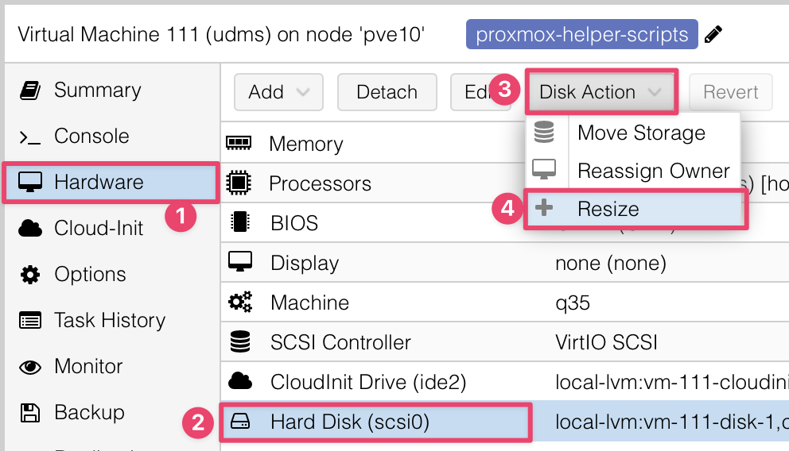

# <i class="fas fa-compact-disc"></i> Network Architecture and Software Stack
{: .no_toc }

## Table of contents
{: .no_toc .text-delta }

1. TOC
{:toc}

---

## Network Architecture Diagram

The diagram below shows the physical network architecture.

{:width="75%"}

### Make a bootable Ventoy USB drive

First, we need to create bootable USB drive with the Proxmox VE ISO. We will use Ventoy to do this.

The latest Ventoy installers are at [https://sourceforge.net/projects/ventoy/files/](https://sourceforge.net/projects/ventoy/files/){:target="_blank"}.

{: .important }
>The Ventoy USB can be created in Linux or Windows only. For **Mac**, use Parallels Windows VM or Linux VM.
>
> **After** you have created the Ventoy USB, you can **copy files to it** using your Mac or PC.

