# <i class="fas fa-compact-disc"></i> Network Architecture and Software Stack
{: .no_toc }

## Table of contents
{: .no_toc .text-delta }

1. TOC
{:toc}

---

## Network Architecture Diagram

The diagram below shows the physical network architecture.

{:width="75%"}

## Software Stack

The diagram below shows the software stack.

{:width="75%"}